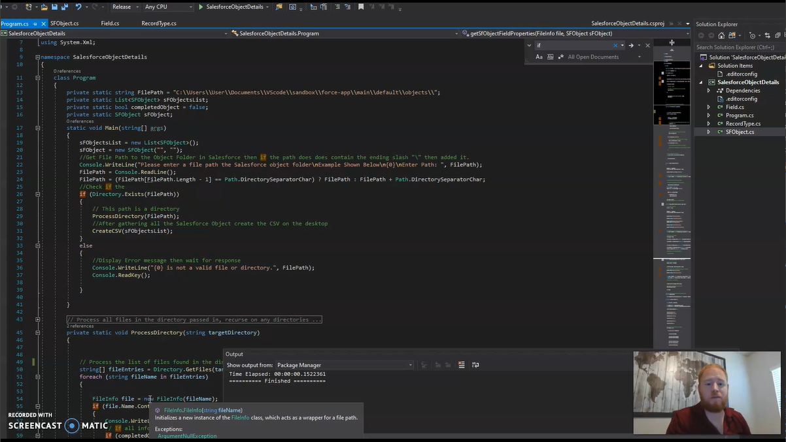
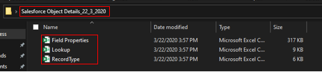
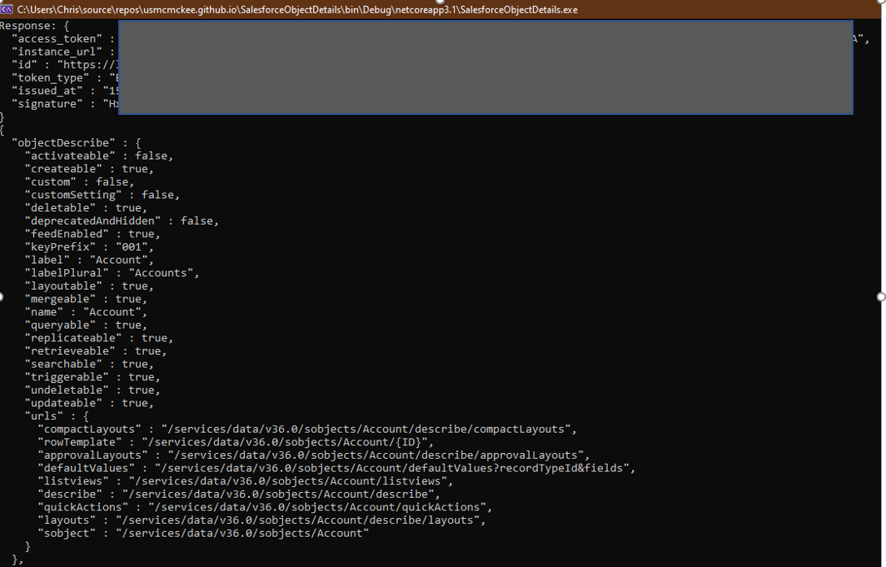
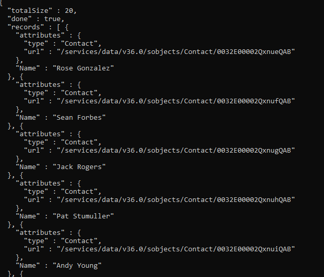
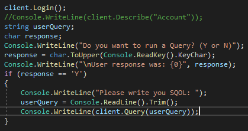
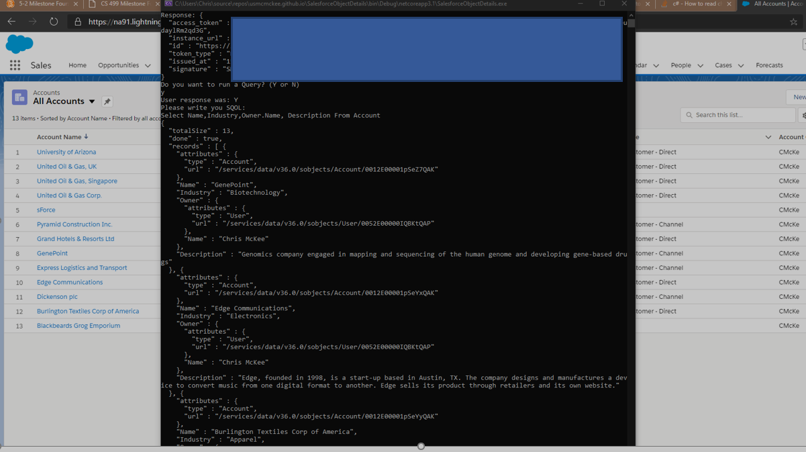
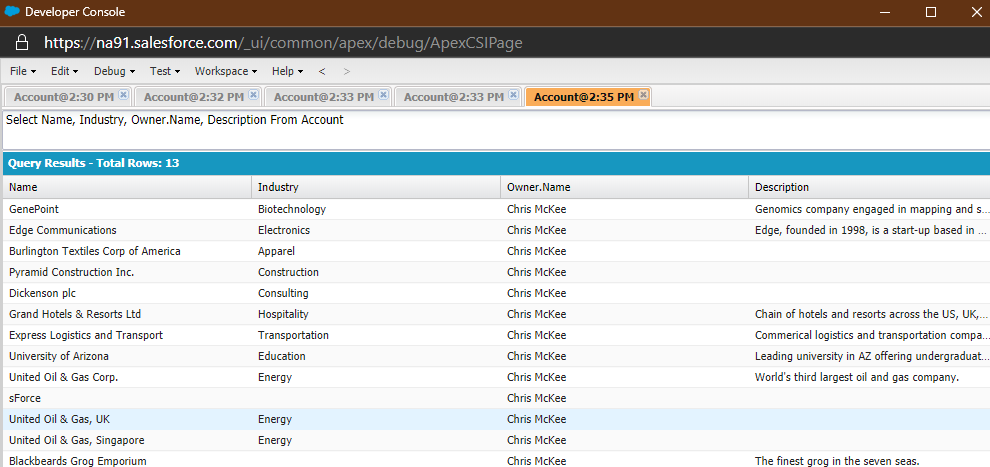

# Contents

[II. Code Review](#code-review)

[III. Enhancement One - Generate CSV for Lookup and Record Types
1](#enhancement-one---generate-csv-for-lookup-and-record-types)

[IV. Enhancement Two – Develop Rest Services to Copy the Salesforce CLI
Functionality
2](#enhancement-two-develop-rest-services-to-copy-the-salesforce-cli-functionality)

[V. Enhancement Three – Develop/Test Query Functionality.
3](#enhancement-three-developtest-query-functionality.)

## Professional Self-Assessment

sss

## Code Review

In the beginning of this project I pulled up the original source code that I wrote about 3 weeks prior. I described and critically analyzed my existing code to get an understanding of the quality and assist with evaluating the level of effort for each additional feature. After completing the review, I had a strong foundation for the quality of code and was able to plan new sprints that would incorporate new features of my backlog.

(Click image to download part 1 of the code review)

(Click image to download part 2 of the code review)

## Enhancement One - Generate CSV for Lookup and Record Types

During sprint one, I have completed 2 of the required features for phase
2 of my Refinement Plan. I have generated two new CSV file. The first
one contents all of the lookups to another object. The second CSV file
contains all record types for each Salesforce Object. In addition to the
features, I have refactored all comments to include XML comments that
C\# traditionally uses for documentation. The was a design flaw that I
noticed with where the file was being stored. Now that there is three
CSV for each file, the desktop will get disorganized. To solved this, I
have created a new folder. This folder will contain all three CSV files,
and the CSV file names have shortened to include only the purpose. I
have pushed all of the code into our source control and removed and code
or comments that could contain sensitive information. I have included a
picture of the results. However, I cannot provide you a screenshot or
copy of the data inside the CSV. The CSV contains my client's
information. However, If you have a Salesforce environment and use the
Salesforce CLI and DX, then you can run this on your organization to
document custom object details. There results from the application can
be seen in figure 1.

(Figure 1)

## Enhancement Two – Develop Rest Services to Copy the Salesforce CLI Functionality

During sprint two, I have completed all requirements phase 3 of my
Refinement Plan. To develop the Rest functionality, I would need to
authenticate the console application to a Salesforce environment (Org).
In the past few weeks, I have been using my client's environment. Now
that I will need to make a change, I will shift to using a Salesforce
Developer Org. The first thing I did was to create a Connected App in
Salesforce. This Connected App is where I set the scope of access and
obtain the client id/secret for the application. After the Salesforce
configuration was set, I added an App.config file to my app. The
App.config file is where I store the Username, Password, Client ID,
Client Secret, and additional security token used with the user
password. As for the code, one new class was added, and additional test
code was added to main. An open-source resource provided the new Web
Service Class. The instructions and helper class code can be found at
this
[link.](https://blog.mkorman.uk/integrating-net-and-salesforce-part-1-rest-api/)
Next phase I will begin to adjust the code to mimic the CSV output. In
Figure 2 you can seen response from a successful connection and figure 3
contain records from Salesforce.

(Figure 2)

(Figure 3)

## Enhancement Three – Develop/Test Query Functionality

During sprint three, I have completed all requirements phase 4 of my
Refinement Plan and focus on the database query functionality. With the
REST call service, I developed in the previous sprint, I have been able
to pull record custom data from a live service. Previously, the data was
added by pulling down the information using the CLI tool and storing it
on the locale machine. Then the record had to be parsed to pull a CSV.
Now with the Web Services created, I can remove the manual process from
my application. In the screenshots, you can see that Salesforce has 13
records under the Account table. The response from the web query via the
console application has 13 records in it. The app prompts the user if
they would like to write a custom query (Salesforce, this is called
SOQL). In figure 4 you can see the new code that allows the user to
enter a custom SOQL query. Figure 5 Shows an over lay of the console
application results on top of live Salesforce data. Lastly, Figure 6
show the SOQL state in the developer console of Salesforce, these was
used to valid results and test that the statements were correct.

(Figure 4)

(Figure 5)

(Figure 6)
